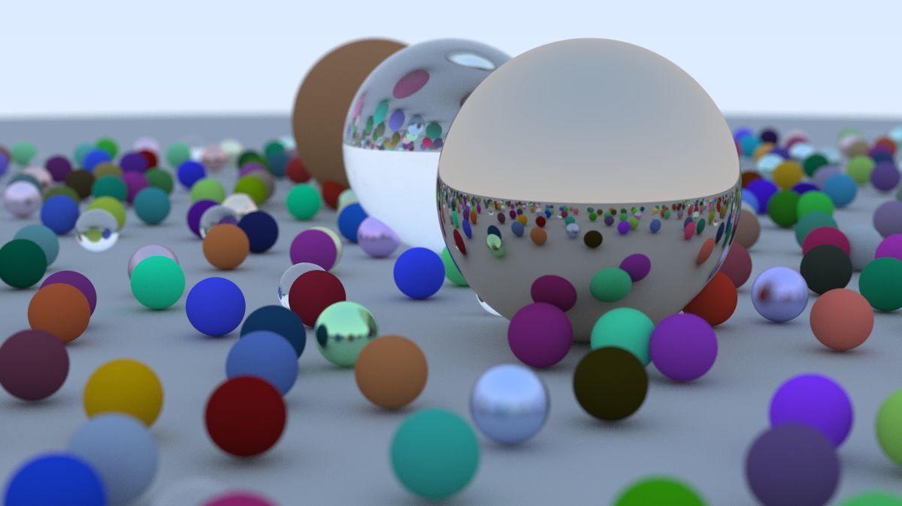

# Raytracing

This is a simple raytracing project. I did this as a refresher of C++, and to 
learn to setup a C++ project structure with CMake.

This is made following the book [Ray tracing in one weeked](https://raytracing.github.io/books/RayTracingInOneWeekend.html). 
It just follows the steps laid out there with some minor additions including project layout.

Using this you can render pictures like.

